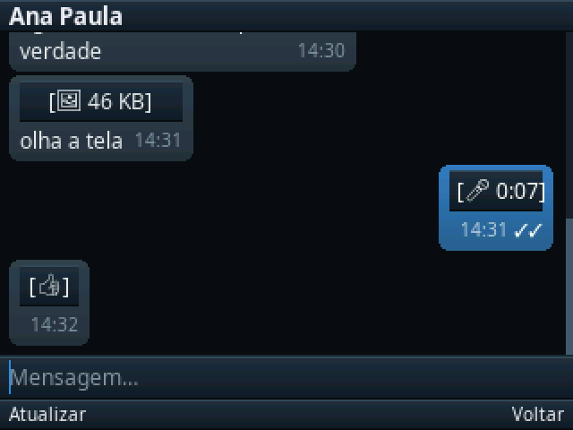
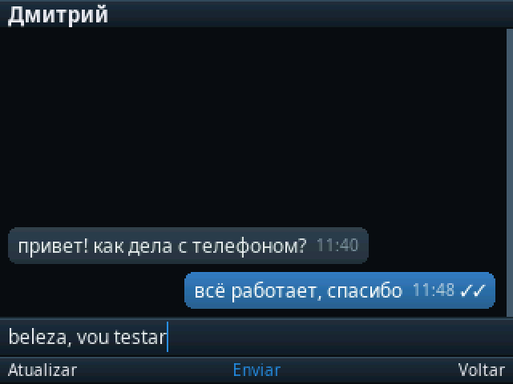
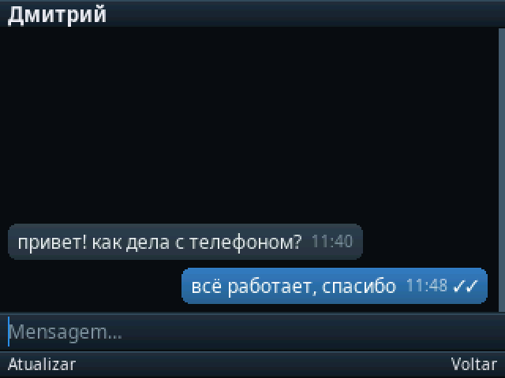
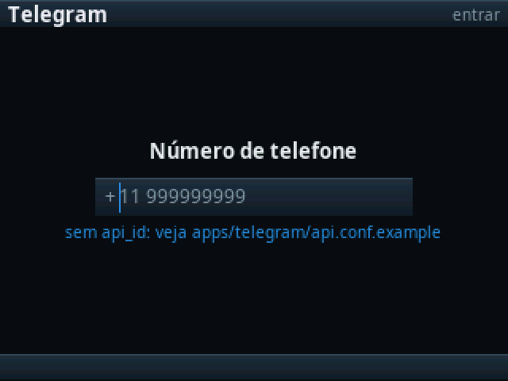

# tg - a Telegram client for Symbian

Runs on a Nokia E72 from 2009. Written in Rust on the
[epoc](https://github.com/pizzaria-foundation/epoc) SDK, which it depends on by revision.

MTProto 2.0 is implemented here from the specification - the PQ factorisation, the
Diffie-Hellman handshake, the encrypted session, TL serialisation, SRP for two-factor -
and the client negotiates a session against Telegram's real servers.

## Screens

Rendered from the app's own drawing code by `cargo run --example preview`, at 2x. The
content is `Store::mock()` - invented names and invented messages, not anybody's
conversation.

| | |
|---|---|
|  |  |
| The chat list: avatars from initials, unread badges, per-chat time | A transcript: bubbles grouped by sender, a photo, a voice note, delivery ticks |
|  |  |
| Typing into the composer, with the caret and the Send softkey | Cyrillic and Greek, from the same atlases the device uses |
|  |  |
| The phone-number screen, first of three in the login exchange | The same list in the light palette |

The chat list's left softkey is **Opções**, not "Atualizar": one slot cannot be spent on one verb
once there is a second thing to offer. The menu carries Atualizar — still the first entry, so the old
habit of left-then-middle still refreshes the list — and the device log's run-time switch, whose
label reads `Log: ligado` or `Log: desligado` so a toggle nobody can see is not something you have to
guess at. `DEBUG=` in `app.conf` still decides whether the log is compiled in at all.

**It stops when the phone goes into a pocket.** The home screen publishes the keypad lock
(`symbian::device::LOCK_KEY`) and this client watches it: locking drops the link and cancels every
timer that would rebuild it, unlocking connects again with the retry budget cleared — a pocket is not
one of the three strikes. The status line says `pausado` so the screen can explain itself.

The link goes and not just the retries, and the reason is other applications: `connd` releases the
WLAN a minute after the lock, but releasing is `RConnection::Close`, which drops *that* daemon's
reference — the interface stays up while anything else holds a socket. A client that only stopped
retrying would keep the radio associated for as long as the phone sat in a pocket and quietly defeat
the parking for everything else on the handset.

That is a 320x240 screen with no touch input: every one of those is driven by the D-pad,
the two softkeys and the QWERTY. The rasterizer, the fonts and the layout are all the
SDK's - see [symbian-gfx and symbian-ui](https://github.com/pizzaria-foundation/epoc) - and none of it
uses an Avkon widget, which is why it looks like this rather than like a 2009 Nokia menu.

## Building

Host tests and the simulator need nothing but the pinned SDK:

    cargo test --workspace                 the protocol and the chat logic, on the host
    cargo run --example sim                the app in a window on your desktop
    cargo run --example preview            every screen to preview-out/*.png

The device build needs an epoc **checkout**, because the toolchain, the C++ shim and the
packaging live there and no crate can carry them:

    git clone git@github.com:pizzaria-foundation/epoc.git     once, anywhere
    ../epoc/tools/epoc build .                    -> build/telegram.sis

Working on both at once? Point cargo at the local SDK instead of the pinned revision with
a `[patch]` block in `Cargo.toml` - one line per crate, and no dependency lines to revert
afterwards:

    [patch."ssh://git@github.com/pizzaria-foundation/epoc"]
    symbian = { path = "../epoc/crates/symbian" }
    symbian-ui = { path = "../epoc/crates/symbian-ui" }
    # ... and the rest as needed

`dist/telegram.sis` is the built package, committed so that installing needs no toolchain and
no build: download it, copy it to the phone, open it (App. mgr.). It is unsigned — `SIGN=0` in
`app.conf` — so it needs a patched installserver (Open4All / RomPatcher+), which is what the
dev handset has. One executable, no daemons; the app is the whole package.

That committed package carries **no credentials**, and refreshing it must keep it that way.
`link::api_id()` reads `option_env!("TG_API_ID")`, which `tools/symbuild` exports from
`api.conf` — so a rebuild on a machine that has credentials bakes them into the `.exe` as
string literals, and copying that `.sis` into `dist/` publishes them. Build with `api.conf`
moved aside before updating `dist/`; the result is an app that reaches Telegram and is
answered `API_ID_INVALID`, which is the correct behaviour for a package anyone can download.

Credentials go in `api.conf`, which is gitignored. Copy `api.conf.example` and fill it in:
`api_id` and `api_hash` from my.telegram.org. Without them the build still works and `auth.sendCode` answers `API_ID_INVALID`,
which proves the request reached Telegram and was understood.

## Three crates, on purpose

    proto/     tg-proto    rlib,      MTProto. No I/O at all
    .          tg          rlib,      the UI, and the seam in link.rs
    device/    tg-device   staticlib, the entry points the shim calls

`tg-proto` is the protocol and touches no platform - no sockets, no clock, no randomness
of its own. Everything is passed in, which is what lets the whole handshake be replayed
byte for byte in a host test. See its own README.

`tg` is the application: what a row looks like, where a bubble breaks, what a key does.
A plain rlib with no `#[global_allocator]` and no `#[panic_handler]`, which is what lets
`cargo test` run the chat logic on the host. `link.rs` is where the protocol meets the
platform - a socket, a worker thread, a random source - turning shim events into
`Progress`.

`tg-device` carries the runtime items and does nothing else. Anything in it that looks
like a policy decision is in the wrong crate. It is **not** a workspace member and cannot
be: a crate defining `#[panic_handler]` fails to build for the host, because cargo links
the test harness against `std`, which already defines one. It is its own workspace root
with its own `target/`, and only ever builds for ARM.

## Modules

    proto/  tl, schema, walk    TL serialisation and the constructor table
            pq, crypto, keys    factorisation, AES-IGE, the server's RSA keys
            handshake, session  the auth-key exchange, then the encrypted session
            auth, srp           login: code, sign-in, two-factor, migration
            rpc, chats          requests and the answers they parse into

            link                the seam: sockets, worker, bearer, reconnection
            driver              what to ask for and when, across two data centres
            login               the three login screens
            chats, conv         the conversation list and the transcript
            model, store_cache  the model, and the copy of it kept on disk
            session_store       the auth key, in the app's private cage

## What is real

Confirmed on the device: the chat list, scrolling and selection, opening a conversation,
the transcript with bubble grouping, typing into the composer, the softkey bar, going
back, the three login screens, and a session negotiated against Telegram over TCP.

Photos download and decode through the handset's own JPEG codec. Voice messages decode -
Ogg/Opus to PCM to WAV, in `symbian-audio` upstream - and the platform will play the
result; `docs/voz-o-que-falta.md` is the honest ledger of what is measured and what is
still only tested on the host.

Not there yet: sending media, drawing the voice waveform, and stickers, which are WebP -
a format that postdates the platform by two years, so the handset cannot decode them at
all and the client has to recognise that rather than discover it as a failed decode.

## Notes for whoever picks this up

`app.conf` holds the whole build manifest. `UID3` there becomes three things that must
agree - the E32 header's UID3, the UID3 in `data/telegram_reg.rss`, and `KUidShimApp` in the
shim via `-DSHIM_APP_UID3` - and `epoc build` wires all three from that one value. Out of
step, you get the least debuggable failure this platform has: AppArc finds a registration
for a UID no installed binary claims, so the icon appears and tapping it does nothing, with
no error and no log.

`DEBUG=1` in `app.conf` turns on `symbian::log!`, which writes to
`C:\Data\_logs\telegram.txt` on the phone; `epoc logs telegram -f` reads it back over the
phone's remote shell as the app writes it. `DEBUG=0` removes those call sites entirely, format strings included, so leaving
instrumentation in the source costs a release build nothing.

The icon is generated by `data/mkicon.py` and not committed. A checked-in `.bmp` is a
binary nobody can review; the generator is the source.

## Names, and what this is not

Telegram is a trademark of Telegram Messenger LLP. This is an unofficial third-party
client, not affiliated with, endorsed by, or connected to Telegram in any way. It talks to
the published MTProto API with credentials the user supplies.

Symbian and EPOC are somebody else's names too - Symbian Ltd's, then Nokia's, with the
trademark at Accenture today, and EPOC originally Psion's. The `epoc` SDK's crate names
are descriptive, not a claim; see that repository's README.

## How this was written

With AI assistance, throughout. Claude wrote and reviewed a large share of this code and
most of these comments, and the commit trailers say so rather than hiding it.

It was still made with care, and the way to check that is to read it:

- The protocol is verified against a **reference implementation, byte for byte** - the
  differential tests in `proto/tests/` replay a recorded handshake, a session and an SRP
  exchange rather than asserting that our own output equals itself.
- Every claim about the hardware was **measured, not reasoned about**. The device notes in
  the SDK are a log of assumptions that turned out wrong.
- The comments say **why**, not what. Where a decision looks strange, the comment names the
  failure that produced it - a truncating append, a socket that panics esock, a decode that
  reported success with no pixels.
- **249 tests, all on the host**, because the interesting bugs are in loops and edge cases
  and a phone is a terrible place to find them.

Neither the assistance nor the care is a substitute for review.

## Licence

MIT. See `LICENSE`.
